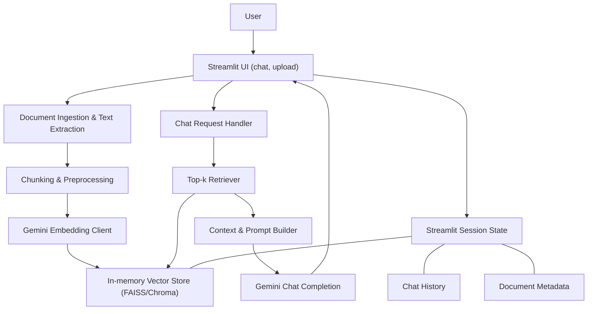

# Business Optima Streamlit RAG Chatbot – Implementation Plan

## High-level architecture (text + diagram)

**Core idea**: A single-page Streamlit app that lets the user upload one document per session, builds an in-memory vector index using Gemini embeddings, and powers a ChatGPT-style Q&A interface over that document using Gemini chat completion.

**Main components**:

- **UI layer**: Streamlit app using `st.chat_message`, `st.chat_input`, `st.file_uploader`, plus custom CSS for Business Optima branding.
- **Document processing**: Small utilities to read PDF/DOCX/TXT, normalize to plain text, then chunk.
- **Embedding & vector store**: Gemini embedding client + FAISS/Chroma index, scoped to a single uploaded document per session.
- **Chat/RAG engine**: Retrieval step + prompt construction + Gemini chat API.
- **Session state management**: `st.session_state` to track document metadata, vector store, chat history, and reset behavior.

**Architecture diagram (conceptual)**:

## Step-by-step data flow (upload → answer)

### 1. App load / initial state

- **User sees** a centered landing layout matching the mock: light grey background, Business Optima logo in top-left, a large heading ("What can I help with?"), and a single white rounded input card.
- **Session initialization**: `st.session_state` keys are set if missing:
  - **`doc_text`**: raw extracted document text (or `None`).
  - **`doc_chunks`**: list of text chunks.
  - **`vector_store`**: FAISS/Chroma index object (or `None`).
  - **`doc_hash` / `doc_name`**: identifies the currently indexed document.
  - **`messages`**: list of `{role, content}` chat turns.
  - **`ready`**: boolean indicating whether a document is successfully indexed.

### 2. Document upload & ingestion

- User uploads one file via `st.file_uploader` (accept `.pdf`, `.docx`, `.txt`, single-file only).
- App computes a **hash** of the file bytes (e.g., SHA-256) and compares with `st.session_state.doc_hash`:
  - If **different or no doc** indexed: treat as new document → clear previous vector store and chat history.
  - If **same**: skip re-processing and keep existing state.
- Based on file extension:
  - **PDF**: use a robust Python PDF reader (e.g., `pypdf` or `pdfplumber`) to extract text page-by-page, concatenating with separators.
  - **DOCX**: use `python-docx` to extract paragraphs.
  - **TXT**: decode bytes directly as UTF-8 (with fallback error handling).
- Normalize extracted text (strip extra whitespace, normalize newlines) and store as `doc_text`.

### 3. Chunking & preprocessing

- Run a **simple, deterministic chunker** over `doc_text`:
  - Target **chunk size**: ~800–1,000 tokens equivalent (e.g., 2,000–3,000 characters) with **overlap** of ~200–300 characters.
  - Split primarily on paragraph or sentence boundaries when possible (e.g., by double newlines, then re-group into chunks within size limits).
- Persist:
  - `st.session_state.doc_chunks = [...]` (ordered list of strings).

### 4. Embeddings & vector index build

- For each chunk, call **Gemini Embeddings API** (batching where possible) to get a dense vector representation.
- Build a **lightweight vector index**:
  - **Option A (recommended)**: FAISS index in memory; keep the mapping `index → chunk` in a Python list.
  - **Option B**: Chroma ephemeral collection stored in a temp directory; `collection_name` tied to session ID.
- Persist in `st.session_state`:
  - `vector_store`: the FAISS/Chroma object.
  - `ready = True` once build completes.

### 5. User asks a question

- User types a question into `st.chat_input`; app only accepts input when:
  - `vector_store` is not `None`, and
  - `ready` is `True`.
- The question is appended to `messages` as a user message and rendered immediately with `st.chat_message("user")`.

### 6. Retrieval

- The handler for new chat input:
  - Uses Gemini Embeddings to embed the **user query**.
  - Runs **top-k (e.g., k=5)** nearest-neighbor search against `vector_store`.
  - Returns a set of `(chunk_text, score)` pairs, sorted by similarity.
  - Optionally filters by a minimum similarity threshold to avoid irrelevant chunks.

### 7. Prompt construction

- Compose a **system prompt** that:
  - Clearly instructs Gemini to answer **strictly** based on provided context.
  - Requires it to say it does not know if the answer is not supported by the context.
  - Encourages concise, professional responses suitable for business users.
- Create a **context block** that concatenates the top-k chunks with separators and minimal metadata (e.g., `Source #1`, `Source #2`).
- Build the **final prompt** (as messages appropriate for the Gemini chat API):
  - System message: instructions + RAG constraints.
  - Context message: the context block.
  - Conversation history: last N turns from `messages` (or only current question for simplicity) to keep cost low.
  - User message: the current question.

### 8. Generation

- Call **Gemini Chat Completion** with the constructed messages.
- On response:
  - Append an assistant turn to `messages`.
  - Render in UI via `st.chat_message("assistant")` with streaming or full-text output (depending on API support and chosen simplicity).
  - Optionally show a subtle "Using uploaded document" label or citation note beneath the answer (no need for detailed source highlighting initially).

### 9. Subsequent turns & reset behavior

- For each new user question within the same session:
  - Reuse the **same `vector_store` and `doc_chunks`**.
  - Use `messages` to preserve conversational context.
- When **user uploads a new document**:
  - Compare hash; if new:
    - Clear `messages` and show a small notice that a new document has been loaded.
    - Re-run steps 2–4 to rebuild the index.
- Provide a **"Reset chat"** button that clears `messages` but keeps the currently indexed document and vector store.

## RAG design decisions and reasoning

### Document ingestion

- **Supported formats**: PDF, DOCX, TXT only, matching the internship requirement and keeping dependencies small and well-understood.
- **Libraries**: Prefer widely used, pure-Python extractors (e.g., `pypdf`, `python-docx`) that work on Streamlit Cloud without system packages.
- **Robustness over perfection**: Handle typical business documents (reports, proposals, briefs) rather than edge-case layouts (complex tables, scans).

### Chunking

- **Chunk size** (~2,000–3,000 characters) balances:
  - Enough context to answer most questions about sections or pages.
  - Not so large that individual chunks exceed Gemini’s context limits or add excessive noise.
- **Overlap** (~200–300 characters) ensures that concepts spanning chunk boundaries remain retrievable.
- Simple textual splitting (paragraphs/sentences) avoids brittle NLP dependencies and keeps performance predictable.

### Embeddings

- Use **Gemini Embedding API** for alignment with the Gemini chat model.
- Generate embeddings **once per document** on upload to minimize latency and API costs.
- When chunk count is moderate, call embeddings in small batches; if a document is very large, cap the number of chunks (e.g., first N chunks) and clearly communicate this limit in the UI.

### Vector store

- **Preference: FAISS** (in-memory) because:
  - Lightweight, no server, no external process.
  - Fits easily into Streamlit Community Cloud’s memory constraints for small/medium documents.
- Index is **session-scoped**:
  - One index per user session → no cross-user leakage.
  - No persistence across restarts, matching the non-persistent requirement.
- In case FAISS is problematic on Streamlit Cloud, fallback to **Chroma** running with sqlite in a temp directory; still session-scoped by clearing or namespacing collections.

### Retrieval

- **Top-k = 5** by default with an optional configurable slider (2–8) in a sidebar for debugging/experiments.
- No reranking or hybrid search to keep the system simple and deterministic.
- Optionally expose a debug toggle for interns to view which chunks were used for the answer (e.g., expandable accordions with source text) without cluttering the primary UX.

### Generation and hallucination control

- Use a clear **system prompt** with rules:
  - Only use the provided document context.
  - If the context is insufficient, explicitly say: *"The document does not provide enough information to answer that"*.
  - Keep tone professional, concise, and business-appropriate.
- Limit **conversation history** sent to Gemini to the last few turns to control token usage while preserving local context.
- Expose a **"strict mode"** toggle in code (or as a simple configuration constant) that can be tuned later if needed (e.g., more conservative responses, requiring explicit citations).

## Proposed project structure

A minimal, clear layout suitable for an internship project:

- **`app.py`**
  - Main Streamlit entrypoint.
  - UI layout, CSS injection, event handling for uploads and chat input.
  - Session state initialization and orchestration of RAG pipeline.

- **`rag/`** (package)
  - **`__init__.py`**: makes this a package.
  - **`document_loader.py`**: functions to load and extract text from PDF/DOCX/TXT.
  - **`text_splitter.py`**: simple chunking utilities.
  - **`embeddings.py`**: Gemini embeddings client and helper functions (batching, error handling).
  - **`vector_store.py`**: abstraction over FAISS/Chroma operations (build index, query top-k).
  - **`chat_engine.py`**: retrieval + prompt construction + Gemini chat call returning answer.

- **`ui/`**
  - **`layout.py`**: functions that render the header, logo, initial empty state, chat history, and side controls.
  - **`styles.py`** (optional): encapsulated CSS strings and helpers for injecting styles.

- **`config/`**
  - **`settings.py`**: central location for tunable constants (chunk size, overlap, top-k default, max chunks, etc.).

- **`assets/`**
  - **`business_optima_logo.png`**: processed logo asset for the top-left corner.

- **`requirements.txt`**
  - Streamlit, FAISS/Chroma, PDF/DOCX parsers, Gemini client library (or `google-generativeai`), and any utilities.

- **`README.md`**
  - Project overview, setup instructions (including how to set the Gemini API key), and deployment notes for Streamlit Community Cloud.

## UI design & layout (Streamlit-only, no React)

- **Page config**: Set via `st.set_page_config` with title "Business Optima Chat", light theme, and wide layout.
- **Background**: Use injected CSS to set a subtle grey background on `body` and full-page centering of the main content.
- **Logo & header**:
  - Place Business Optima logo at the top-left using `st.markdown` with an `` tag or `st.image`, styled via CSS to match the provided mock.
  - Centered main heading text "What can I help with?" in a larger, semibold font.
- **Initial empty chat state**:
  - Vertically centered content when there is no chat history: heading + a white rounded card containing the `st.chat_input` and a hint about uploading a document.
- **File uploader**:
  - Prominently placed just above or below the initial chat card, with label like "Upload a PDF, DOCX, or TXT".
  - After successful upload and indexing, display document name and basic stats (pages, word count estimate).
- **Chat interface**:
  - Use `st.chat_message("user")` and `st.chat_message("assistant")` to render conversation.
  - Stick the input bar to the bottom using CSS, styled as a white rounded pill with subtle shadow, closely mimicking the mock.
  - Add a tiny caption under the input: "AI can make mistakes. Please double-check responses." to mirror the sample UI.
- **Responsiveness**:
  - Use max-width containers and margin auto via CSS to keep chat area centered on large screens.

## State management strategy with `st.session_state`

- **Initialization** (at top of `app.py`):
  - Check and initialize keys: `messages`, `doc_text`, `doc_chunks`, `vector_store`, `doc_hash`, `doc_name`, `ready`.

- **On file upload**:
  - If `uploaded_file` is not `None`:
    - Compute hash; if new:
      - Reset `messages` to empty list.
      - Clear `vector_store`, `doc_chunks`, `doc_text`, `ready`.
      - Process document and build new vector store.
      - Update `doc_hash`, `doc_name`, `ready`.

- **On chat input**:
  - Append to `messages`.
  - Call RAG engine with current `vector_store` and `messages`.
  - Append assistant response to `messages`.

- **Reset controls**:
  - "Reset chat" button: clears `messages` only.
  - "Reset all" button (optional): clears `messages` and document-related state; user must re-upload.

- **No persistence across sessions**:
  - Rely solely on `st.session_state` and in-memory/temporary objects.
  - On app restart or user reconnect, state is lost, which is acceptable for the internship demo.

## Deployment considerations (Streamlit Community Cloud)

- **Dependencies**:
  - Keep `requirements.txt` lean and compatible with Streamlit Cloud (no system-level packages).
- **Secrets**:
  - Expect an environment variable like `GEMINI_API_KEY` to be configured in Streamlit’s **Secrets** UI.
  - In code, read from `st.secrets` or `os.environ` and fail early with a friendly error message if missing.
- **Resource limits**:
  - Cap maximum file size (e.g., 10–20 MB) and number of chunks.
  - Provide user feedback if a document is too large or if chunking/embedding fails.
- **Repository layout**:
  - Include `requirements.txt`, `app.py`, and logo asset at repo root so Streamlit Cloud can auto-detect the app.

## Ordered implementation plan

1. **Bootstrap Streamlit app**

   - Create `app.py`, set page config, initialize `st.session_state`, and add a placeholder layout with a centered heading and chat input (non-functional).
   - Add Business Optima logo asset and basic CSS to match the light grey background and white card layout.

2. **Implement document ingestion**

   - Add `rag/document_loader.py` with functions to ingest PDF/DOCX/TXT.
   - Wire `st.file_uploader` in `app.py` to call these utilities and store `doc_text`, `doc_hash`, `doc_name` in session state.

3. **Implement chunking logic**

   - Add `rag/text_splitter.py` with simple, well-documented chunking functions using configured chunk size and overlap.
   - After ingestion, generate `doc_chunks` and store them in session state.

4. **Integrate Gemini embeddings and build vector store**

   - Add `rag/embeddings.py` to wrap Gemini Embedding API calls (reading `GEMINI_API_KEY` from secrets).
   - Add `rag/vector_store.py` to build and query a FAISS (or Chroma) index from chunk embeddings.
   - On successful index build, set `vector_store` and `ready = True` in session state.

5. **Build the RAG chat engine**

   - Implement `rag/chat_engine.py` to:
     - Retrieve top-k chunks for a query.
     - Assemble a strict system prompt and context block.
     - Call Gemini chat completion and return the answer.
   - Ensure it accepts `vector_store`, `doc_chunks`, and the current question as inputs.

6. **Wire chat input to RAG engine**

   - In `app.py`, handle `st.chat_input` events:
     - Append user message to `messages` and render it.
     - Call the RAG engine with the current question and session state.
     - Append the assistant response to `messages` and render it.
   - Block or warn if the user tries to chat before uploading a document.

7. **Refine UI & UX to match mock**

   - Extract layout and style helpers into `ui/layout.py` and `ui/styles.py`.
   - Polish CSS for spacing, typography, logo positioning, chat bubble styling, and bottom-fixed input bar.
   - Add helper text (e.g., "AI can make mistakes. Please double-check responses.") and an indicator of the currently loaded document.

8. **Add resilience, logging, and edge-case handling**

   - Gracefully handle missing API key, unsupported file extensions, oversized documents, and API errors (show friendly error messages in the UI).
   - Add basic internal logging (via `print` or `logging`) for debugging during the internship.

9. **Document setup and deployment steps**

   - Write `README.md` with clear instructions for local development and Streamlit Cloud deployment.
   - Verify app runs end-to-end on Streamlit Community Cloud using a sample PDF and DOCX.

10. **Optional enhancements (time-permitting)**

    - Add debug mode to show retrieved chunks.
    - Add a simple configuration panel (sidebar) for top-k and strictness.
    - Add token / API usage notes for interns to understand costs.